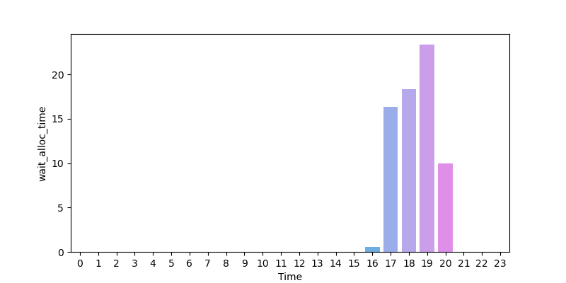
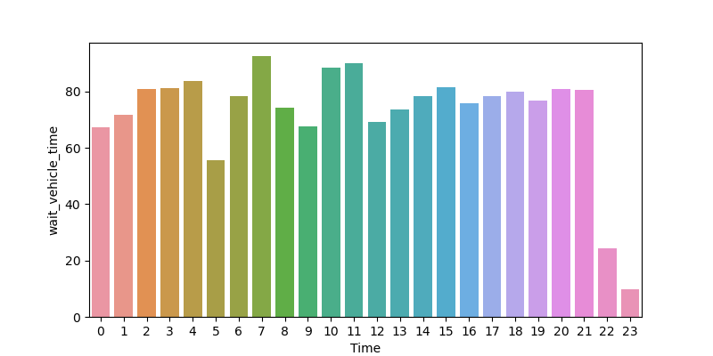

# MAS Wait Time Report

## 시간대 별 공차 시간 평균

- Daily 시간대 별 택시 공차시간 평균 (단위 : 분)
* * *

## 시간대 별 사용자 총 대기 시간 평균
  

- Daily 시간대 별 사용차 총 대기 시간 평균 (단위 : 분)
  - 사용자 총 대기시간 기준 : 배차 요청시점 ~ 택시 탑승 시점

* * *

## 시간대 별 배차 할당 시간 평균
  

- Daily 시간대 별 사용차 배차 할당 시간 평균 (단위 : 분)
  - 사용차 배차 할당 시간 : 배차 요청시점 ~ 배차 완료 시점

* * *

## 시간대 별 배차 할당 후 대기 시간 평균
  

- Daily 시간대 별 사용자 배차 할당 후 대기 시간 평균 (단위 : 분)
  - 배차 할당 후 대기 시간 : 배차 완료 시점 ~ 택시 탑승 시점

* * *